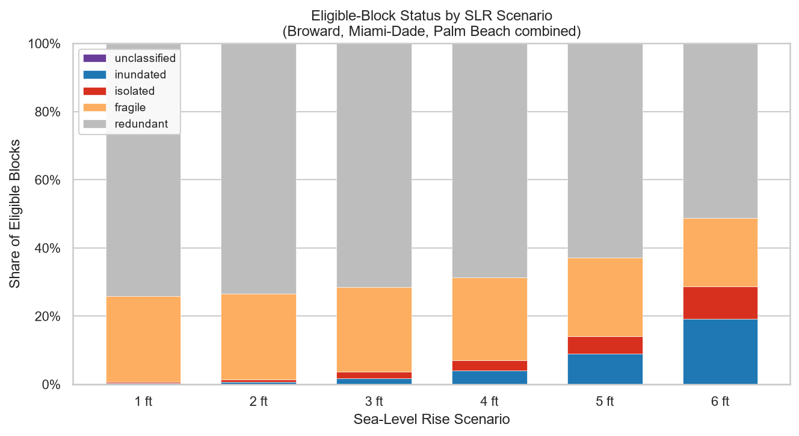

# Sea-Level Rise and Fragile Transportation Access in South Florida

How can sea-level rise degrade access to essential services before communities
are completely inundated? This active research project examines road-network
access in **Broward, Miami-Dade, and Palm Beach counties, South Florida**. It
studies the loss of alternative routes as well as isolation and inundation,
helping frame transportation resilience beyond the footprint of flooding alone.

*Existing research output using the `approach` bridge rule. Shares describe
eligible Census blocks, not population shares; results remain part of active research.*

## Data and access framework

- **NOAA sea-level-rise inundation layers:** a 0 ft reference and 1–6 ft scenarios.
- **OpenStreetMap:** the retained tri-county drivable road network.
- **U.S. Census Bureau:** 2020 TIGER/Line block and block-group geometries,
  2020 block population, and 2022 ACS five-year demographic estimates.
- **Essential services:** public and private primary-school layers and fire
  stations from the project's critical-community-and-emergency-facilities layer.
- **Optional physical covariates:** USGS 3DEP elevation and South Florida Water
  Management District (SFWMD) AHED primary-drainage features.

The model classifies block origins using a capped edge-disjoint-path measure
(alternative paths that do not share road edges) to the combined service layer:

| State | Interpretation |
| --- | --- |
| Redundant | At least two edge-disjoint dry paths to services. |
| Fragile | One dry path; access remains, but lacks route redundancy. |
| Isolated | A non-inundated origin cannot reach a retained service. |
| Inundated | The block's representative origin point intersects inundation. |
| Unclassified | An origin cannot be validly attached to the network. |

Eligibility flags retain and identify excluded blocks, including zero-land-area
blocks and failed origin snaps.

## Methodology

The Python workflow builds an undirected road graph, attaches block origins and
services, and evaluates access under each inundation scenario. Ordinary road
segments are removed on intersection with inundation; physical bridges follow
the selected `approach` (default), `intersect`, or `retain` rule. Block-level
transitions are aggregated to block groups and joined to demographic indicators.
R scripts estimate grouped binomial transition models and average marginal
effects with cluster-bootstrap uncertainty. Separate diagnostics and sensitivity
analyses examine network construction, attachment choices, and spatial dependence.

This is a connectivity model: it does not represent congestion, one-way or turn
restrictions, or travel speeds. Inundation is evaluated at block origin points;
regression denominators count blocks, while separate figures summarize population.

## Repository structure

| Location | Contents |
| --- | --- |
| [`scripts/`](scripts/) | Numbered Python scripts, R models, and Jupyter notebooks; main analytical code. |
| [`outputs/`](outputs/) | Existing figures, tables, spatial outputs, and sensitivity results. |
| [`reports/`](reports/) | Validation, provenance, and manuscript-output reviews. |
| [`docs/`](docs/) | Dataset metadata, methodological notes, and sensitivity documentation. |
| `data/` | Local raw and processed inputs; excluded from Git. |

## Running the workflow

Start with the [detailed workflow guide](scripts/00_README_workflow.md) for input
paths, options, dependencies, and limitations. Run from the repository root.
**Cloning alone is insufficient:** obtain the NOAA, road, service, and Census
inputs listed in [`02_access_flags.py`](scripts/02_access_flags.py) and prepare
the expected local `data/` layout. A complete environment lockfile is not included.

Recommended core order:

1. `01_pull_census_geometries.py` — download/rebuild Census geometries if needed.
2. `02_access_flags.py` — produce scenario-specific block access states and audits.
3. `03_build_extension_dataset_and_memo.ipynb` — validate, aggregate, join ACS data,
   and construct analysis datasets and figures.
4. `03b_join_elevation_drainage.py` — optional inputs for the `with_physical` sensitivity specification.
5. `04_transition_models.R` — fit transition models and export tables; sources
   `04_shared_model_spec.R`.
6. `05_population_figures.py` — produce population summaries and figures.
7. `06_placeholders_in_draft.ipynb` — optional manuscript support from existing tables.

Use `02b`–`02d` and `04b` for diagnostics as documented. The separate
[attachment-sensitivity workflow](docs/attachment_sensitivity/README.md) uses
`07_attachment_sensitivity_workbook.ipynb` and `scripts/attachment_sensitivity/`.

Before a full rerun, check run-directory and bridge-arm settings across stages:
notebook `03` currently expects dated, arm-specific runs under
`data/processed/access/edited/della_runs/`, rather than the access engine's default
output directory. The detailed guide also references `slurm/run_access_flags.sbatch`,
which is not tracked in this checkout; cluster setup requires separate preparation.

**Software:** Python, R, and Jupyter. Key Python packages include GeoPandas,
Shapely, NetworkX, pandas, NumPy, SciPy, PyArrow, Pyogrio, PyProj, and Matplotlib.
R dependencies include tidyverse, fixest, marginaleffects, and openxlsx, plus
sf and spdep for spatial diagnostics. See the workflow guide for details.

This repository contains **active academic research**. Documentation, workflows,
and outputs may evolve; exploratory and sensitivity artifacts are retained for
research provenance.
